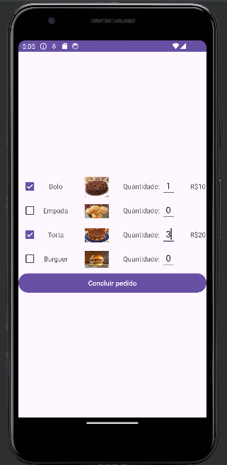
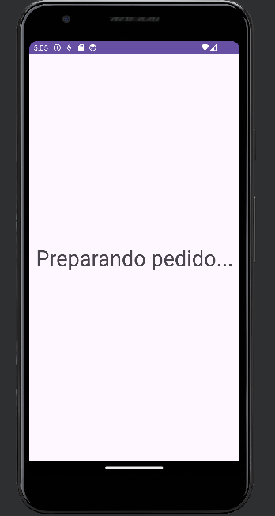
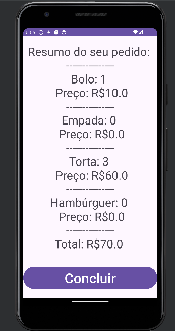

# Aplicativo de Pedido de Restaurante

Este é um aplicativo Android simples para fazer pedidos em um restaurante. Ele permite que o usuário selecione os alimentos desejados, especifique a quantidade de cada alimento e, em seguida, visualize um resumo do pedido com o valor total.

## Funcionalidades Principais

1. **Seleção de Alimentos**: O usuário pode selecionar os alimentos desejados marcando as caixas de seleção correspondentes.
2. **Especificar Quantidade**: Para cada alimento selecionado, o usuário pode especificar a quantidade desejada através de campos de texto.
3. **Visualizar Resumo do Pedido**: Após especificar a quantidade de cada alimento, o usuário pode clicar em um botão para visualizar um resumo do pedido, incluindo a quantidade de cada alimento selecionado e o preço total.
4. **Tela de Espera**: Após confirmar o pedido, o usuário é redirecionado para uma tela de espera antes de ver o resumo do pedido.

## Estrutura do Código

O aplicativo é composto por três atividades principais:

1. **MainActivity**: A atividade principal onde o usuário seleciona os alimentos desejados e especifica a quantidade.
2. **SplashScreenActivity**: Uma tela de espera exibida antes de mostrar o resumo do pedido.
3. **DadosPedidoActivity**: A atividade que exibe o resumo do pedido com a quantidade de cada alimento selecionado e o preço total.

## Tecnologias Utilizadas

- **Linguagem de Programação**: Kotlin
- **Bibliotecas**: Android Jetpack (incluindo ViewBinding)

## Fluxo de Funcionamento

1. O usuário abre o aplicativo e seleciona os alimentos desejados, especificando a quantidade de cada um.
   
   
3. Ao clicar em "Concluir Pedido", o aplicativo exibe uma tela de espera por alguns segundos.
   
   
5. Após a tela de espera, o aplicativo mostra o resumo do pedido na tela.

   
   
